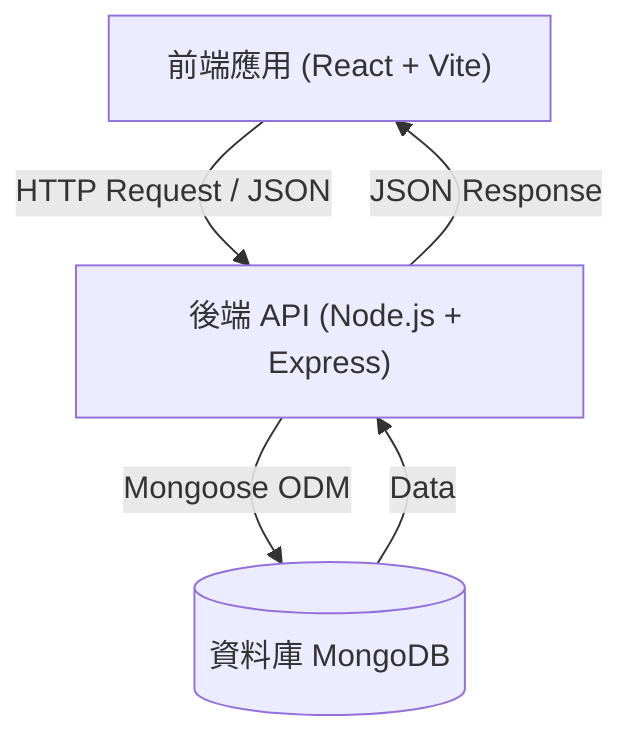
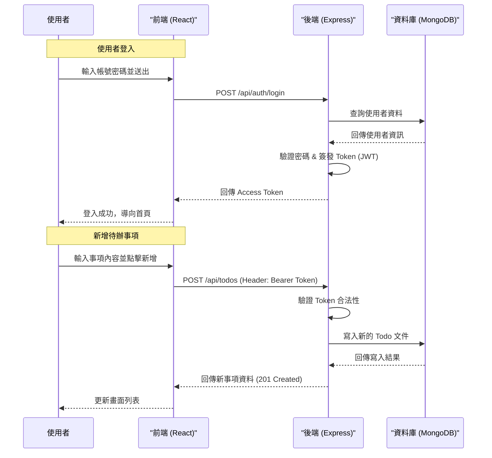

# 個人待辦事項系統 (Personal Todo System)

這是一個使用 **React**、**Node.js (Express)**、**MongoDB** 和 **Docker** 建構的現代化全端待辦事項應用程式。

## 專案功能
-  現代化 Glassmorphism 使用者介面
-  建立、讀取、更新、刪除待辦事項 (CRUD)
-  狀態與優先級管理
-  容器化的 MongoDB 資料庫
-  響應式設計 (Responsive Design)

## 技術選擇
- **React**: 擁有龐大的生態系統與元件化開發模式，適合建構互動性高的現代化 UI。
- **Node.js + Express**: 輕量、高效且與前端共用 JavaScript 語言，降低開發切換成本。
- **MongoDB**: NoSQL 資料庫的靈活性非常適合處理待辦事項這類結構多變的資料 (JSON-like)。
- **Docker**: 提供一致的開發與部署環境，消除「在我的電腦上可以跑」的問題。

## 系統架構

### 架構圖
本專案採用經典的前後端分離架構，資料庫使用 MongoDB 進行資料持久化。



### 使用者流程圖 (登入與新增事項)
以下展示使用者登入系統並新增一個待辦事項的資料流向。



## 安裝與執行指引

### 先決條件
請確保您的電腦已安裝以下軟體：
- [Node.js](https://nodejs.org/) (v14 或更高版本)
- [Docker](https://www.docker.com/) & Docker Compose
- [Git](https://git-scm.com/)

### 1. 啟動資料庫
使用 Docker Compose 快速啟動 MongoDB 服務：
```bash
docker-compose up -d
```

### 2. 後端設定與啟動
進入後端目錄，安裝依賴套件並啟動伺服器：
```bash
cd backend
npm install
# 啟動開發伺服器 (預設埠號 5000)
npm run dev
```

### 3. 前端設定與啟動
進入前端目錄，安裝依賴套件並啟動開發伺服器：
```bash
cd frontend
npm install
# 啟動前端開發環境 (預設埠號 5173)
npm run dev
```

啟動後，請在瀏覽器開啟 `http://localhost:5173` 即可使用應用程式。

## 專案結構說明
- `backend/`: 後端 API 程式碼、Mongoose 模型與控制器
- `frontend/`: 前端 React + Vite 應用程式原始碼
- `docs/`: 專案文件與資源
- `docker-compose.yml`: Docker 編排設定檔

## API 參考文件
詳細的 API 規格請參閱 [docs/api-spec.md](docs/api-spec.md)。
